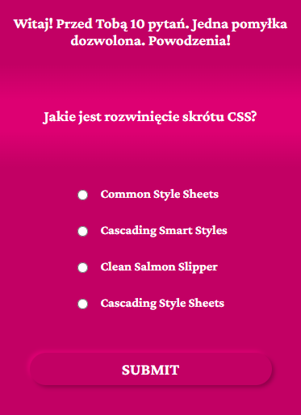

# Story-React

The project is a quiz with programming questions, which is fetched from Firebase. The quiz has 10 questions and 4 answers per question. Only one answers are good. Answers are displayed in random order. After a good answer, part of the story is displayed. After correct answers to all questions section with questions, answers and button is slide up. 

**Fast preview:[ webside](https://pawel-jezior.github.io/story-react/)**

## Used technologies:

- JS (React.js + JSX)
- SCSS
- HTML

## View

## How to run the program

**1.** Clone the repository on your device. In your cmd paste this command: 

`git clone https://github.com/pawel-jezior/story-react.git`

**2.** In cmd paste this command: 

`npm run start`

**3.** Run on your browser by localhost: http://localhost:3000

**4.** Enjoy the quiz and story!

or run final project **[here](https://pawel-jezior.github.io/story-react/)**.

## Tested on:

- Chrome
- EDGE
- Firefox
- Opera

